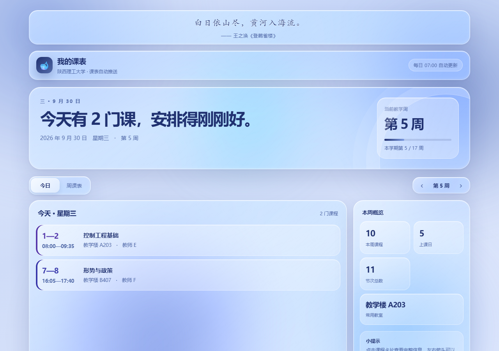

# 陕理工课表小助手

> 陕西理工大学（金智统一身份认证 + 树维 EAMS）的**课表自动推送 + 课表网站**。
> 每天定时登录教务系统抓一次课表 → 把当天的课发到手机 → 同时生成一份脱敏快照，
> 供一个只读网页展示。



<sub>截图使用虚构的演示数据（教师 A/B/C…、示例教室），不含任何真实个人信息。</sub>

> 💬 **关于这个项目**：这是我的**第一个开源项目**，开发过程中大量借助 AI 辅助（也就是大家说的 **vibe coding**）——
> 能跑、能用，但代码风格未必成熟，边界情况也未必都考虑到了。
> 如果在使用中遇到异常、或觉得某处写得不合理，欢迎到 [Issues](https://github.com/genhaoer66/snut-course-notifier/issues) 反馈，也欢迎 PR。
> 我会尽量跟进，请多包涵 🙏

---

## 目录

- [它解决什么问题](#它解决什么问题)
- [特性](#特性)
- [架构](#架构)
- [快速开始](#快速开始)（🤖 [交给 AI 助手配置](AGENT_SETUP.md)）
- [配置项](#配置项)
- [命令](#命令)
- [这个学校系统的坑](#这个学校系统的坑)
- [部署](#部署)
- [适配其他学校](#适配其他学校)
- [安全边界](#安全边界)
- [免责声明](#免责声明)
- [License](#license)

---

## 它解决什么问题

陕西理工大学的教务系统响应慢（单次请求 17–20 秒）、有防刷机制（请求过密返回
「请不要过快点击」）、手机上不好用。本项目把「查课表」变成两条**被动接收**的渠道：

- 每天早上一条邮件到手机（可选再推一份到微信）；
- 随时打开网页看今日课表与整周课表（手机端优先）。

## 特性

| | |
|---|---|
| **一次抓取，多个产物** | 同一个进程既发推送、又写网站数据，不需要跑两次登录 |
| **三层会话策略** | 复用 Cookie → 静默 SSO（CAS 票据）→ 完整登录，日常运行基本不触发风控与验证码 |
| **全局限速** | 所有请求经 `ThrottledAdapter` 强制保持最小间隔，避免被判定为刷接口 |
| **脱敏快照** | 白名单导出字段，学号、内部学生 ID、课程编码**绝不会**出现在快照里 |
| **只读网站** | 网站进程不 import 任何碰学校系统的模块，内存里没有学号/密码/Cookie |
| **可选访问口令** | 无状态 HMAC token（重启甚至换机都不失效）+ 同 IP 失败限速 |
| **纯静态前端** | 零外链、零构建步骤，液态玻璃界面，手机端优先 |
| **失败不静默** | 登录/抓取失败会发告警邮件，避免「几周后才发现早就不推了」 |
| **可选验证码 OCR** | 装了 `ddddocr` 自动识别，没装就降级为人工登录脚本 |

## 架构

设计目标只有一条：**一次抓取，多个产物**。

```text
定时任务（例如每天 7:00）
  │
  ├── 登录 authserver.snut.edu.cn      （金智统一身份认证 / CAS）
  ├── 抓取 jwgl.snut.edu.cn/eams       （树维 EAMS，接口返回 JavaScript 而非 JSON）
  ├── 解析课表 → CourseTable
  │
  ├──> 邮件 / Server酱                 （推送侧：只服务于自己）
  └──> data/timetable.json             （脱敏快照）
              │
              ▼
      uvicorn 127.0.0.1:8000 ──> Cloudflare Tunnel ──> 浏览器
```

### 两条铁律

**① `snut/webapp.py` 不 import `auth` / `course` / `captcha`。**
网站只读 `data/timetable.json`。一旦破了这个边界，网站就从「静态文件服务器」
变成了「代理风控的入口」——同学每刷一次页面都会给学校增加一次请求。

**② `snut/snapshot.py` 只导出白名单字段。**
绝不用 `__dict__` / `vars()` 整包抛出。整包抛出的问题是：以后给 `Activity`
加个字段，会**静默**出现在公网上；白名单则相反——新字段默认不公开。

## 快速开始

> 🤖 **不想手动配置？** 把 [AGENT_SETUP.md](AGENT_SETUP.md) 里的提示词整段复制给你的 AI 助手
> （Claude Code / Cursor / ChatGPT…），它会问你要几个必要信息，然后自动克隆、装依赖、验证登录、
> 抓一次课表并起网站给你预览。

需要 Python 3.8 或更高版本（本地 3.8.6 与服务器 3.13 均已实测）。

```bash
git clone https://github.com/genhaoer66/snut-course-notifier.git
cd snut-course-notifier

python -m venv .venv
# Windows
.venv\Scripts\activate
# Linux / macOS
source .venv/bin/activate

python -m pip install -r requirements.txt
# 可选：自动识别登录验证码（会额外安装较大的 OCR / ONNX 依赖）
python -m pip install -r requirements-optional.txt

cp .env.example .env        # Windows 用 copy
# 然后编辑 .env，至少填学号、密码、本学期第一周周一
```

先确认登录环节通了：

```bash
python scripts/test_login.py     # 诊断登录：成功 / 密码错误 / 需要验证码
python -m snut.main --dry-run    # 抓一次课表并打印，不发推送、但会更新网站快照
```

起网站看效果：

```bash
python -m uvicorn snut.webapp:app --host 127.0.0.1 --port 8000
# 浏览器打开 http://127.0.0.1:8000
```

不想装 Python 也能看界面（`demo/index.html` 是纯静态的 UI 预览）：

```bash
python -m http.server 8765 --directory demo
```

## 配置项

全部配置集中在项目根目录的 `.env`（已被 `.gitignore` 忽略，不会进版本库）。
完整说明见 [`.env.example`](.env.example)。

| 变量 | 必填 | 说明 |
|---|---|---|
| `SNUT_USERNAME` | ✅ | 学号 |
| `SNUT_PASSWORD` | ✅ | 教务系统密码（代码内按学校要求 AES 加密后再提交） |
| `SEMESTER_START` | 建议 | 本学期**第 1 周周一**，`YYYY-MM-DD`。不填则不按周次过滤 |
| `SMTP_USER` / `SMTP_AUTH_CODE` / `MAIL_TO` | 发邮件时 | 注意 `SMTP_AUTH_CODE` 是**邮箱授权码**，不是登录密码 |
| `SERVERCHAN_KEY` | 可选 | Server酱 SendKey，填了才推微信 |
| `WEB_PASSWORD` | 可选 | 网站访问口令。留空＝完全公开 |
| `EAMS_BASE` / `AUTH_BASE` | 一般不用改 | 教务系统与统一认证地址 |
| `HTTP_TIMEOUT` | 建议 60 | 学校服务器很慢，别设太小 |
| `REQUEST_INTERVAL` | 建议 ≥2 | 两次请求之间的最小间隔（秒），防刷 |
| `DEBUG_SAVE_RAW` | 调试 | 设为 `1` 会把抓到的原始响应存到 `logs/` |

## 命令

```bash
python -m snut.main                      # 推送今天的课表
python -m snut.main --for tomorrow       # 推送明天的课表
python -m snut.main --dry-run            # 只抓取和打印，不发推送（仍会更新网站快照）
python -m snut.main --week 9             # 手动指定教学周次
python -m snut.main --no-snapshot        # 不更新网站快照
python -m snut.main --help

python -m unittest discover -s tests -v  # 单元测试
python -m compileall -q snut scripts     # 语法检查
node --check web/app.js                  # 前端语法检查
```

诊断工具（不参与日常运行）：

```bash
python scripts/test_login.py             # 登录诊断
python scripts/debug_course.py           # 课表结构诊断，把原始响应存到 logs/
python scripts/captcha_login.py fetch    # 验证码人工兜底：先抓图
python scripts/captcha_login.py submit <验证码>
```

## 这个学校系统的坑

> 这段是本项目最值钱的部分——全部是实测踩出来的。
> **陕理工不是正方教务系统**，网上 99% 的「Python 爬课表」教程（`/jwglxt/`、
> `xskbcx.aspx`）在这里一行都用不上。

| # | 坑 | 正确做法 |
|---|---|---|
| 1 | 登录页有 **4 套表单**（生物识别/短信/账号密码/扫码），`id` 重复，第一个 `id="cllt"` 属于生物识别表单 | 硬编码 `cllt=userNameLogin`、`dllt=generalLogin`，不要去解析 |
| 2 | `startWeek=1` 只返回第 1 周的课（实测 28 门缩成 1 门） | `startWeek` 必须传**空串**；另外不能传 `project.id`，传了 500 |
| 3 | `ids` 不是学号 | 它是学校数据库里的学生记录内部 ID，要从课表页 JS 里现场提取 |
| 4 | 周次位图 `"0111000..."` 的下标 | **第 i 位就是第 i 周**，第 0 位只是占位符。写成 `i+1` 会让所有课程整体偏移一周 |
| 5 | 落格索引 | `index = 星期 * unitCount + 节次`，星期与节次**都从 0 开始** |
| 6 | CAS 会把 302 指向 `http://authserver...`（80 端口不通） | 照此重定向会一直卡到超时（`WinError 10060`），必须在 adapter 里强制升级为 https |
| 7 | 有防刷机制 | 请求过密会返回「请不要过快点击」而不是数据，必须全局限速 |
| 8 | 教务系统**没有**学期起始日期接口（`schoolCalendar!search.action` 返回 404） | `SEMESTER_START` 只能手工维护，**且不能用「哪几周空着」反推** |
| 9 | 空白周 ≠ 假期 | 可能是**实训周**（集中实践环节，全校不上常规课）。要拿学校的调课通知来验证，校方口径 > 任何推算 |
| 10 | 登录失败若干次后会要求**图形验证码** | 会话复用能大幅降低触发概率；真遇到可用 OCR 或人工兜底脚本 |

第 4、8、9 条尤其危险：**算错一周，邮件和网站都会显示「看起来很正常」的错课**，极难发现。
详见 [docs/ARCHITECTURE.md](docs/ARCHITECTURE.md)。

## 部署

抓取任务建议用 cron / systemd timer，每天执行一次；网站服务只监听 `127.0.0.1`，
公网入口交给 Cloudflare Tunnel（这样源站不开放任何入站端口）。

- [DEPLOY.md](DEPLOY.md)：抓取任务与服务器基础部署
- [DEPLOY-WEB.md](DEPLOY-WEB.md)：网站服务、Cloudflare Tunnel 与运维

> ⚠️ 定时任务**建议避开整点**（学校服务器在整点前后负载高，也更容易被风控注意到）。
> 例如要「早上 7 点」，可以用 `3 7 * * *`（7:03）。

## 适配其他学校

**目前本项目只适用于陕西理工大学**：`snut/auth.py`（金智 CAS）与
`snut/course.py`（树维 EAMS 的 JavaScript 课表解析）都是照着这所学校的系统写的。

好消息是学校相关的部分被收敛在了两个模块里，其余模块**完全不关心学校细节**：

```text
snut/config.py      读配置
snut/auth.py        ← 学校相关：登录
snut/course.py      ← 学校相关：抓取 + 解析，产出 CourseTable
snut/formatter.py     只认 CourseTable
snut/notify.py        只认文本 / HTML
snut/snapshot.py      只认 CourseTable
snut/webapp.py        只认快照 JSON
web/                  只认 /api/timetable 的字段
```

所以移植的边界很清楚：**只要新的 provider 能产出 `CourseTable`（一组 `Activity`），
推送和网站一行都不用改**。真要做多校支持，合理的重构方向是：

1. 定义 `AuthProvider.ensure_login()` 与 `CourseProvider.load_table()` 两个接口；
2. 把 `auth.py` / `course.py` 变成 `providers/snut/` 下的实现；
3. `config.py` 增加 `SCHOOL=snut` 之类的选择项，按学校注入不同 provider；
4. 其余模块保持不动——它们的输入始终是 `CourseTable` 与快照 JSON。

欢迎 issue / PR 补充其它学校的实现（特别欢迎「登录页表单结构」「课表接口返回格式」
这类实测记录，比代码本身更难获取）。

## 安全边界

| 风险 | 措施 |
|---|---|
| 学号 / 内部 ID 泄漏 | 快照白名单导出，从源头排除 |
| 账号密码泄漏 | 只存服务器本地 `.env`（权限 `600`），已 `.gitignore` |
| 会话泄漏 | `.session/cookies.json` 等同于登录凭证，已 `.gitignore`，不要外传 |
| 网站被陌生人查看 | `WEB_PASSWORD` 共享口令（留空则完全公开） |
| 口令被暴力破解 | 同 IP 连续错 8 次锁 5 分钟 |
| 被搜索引擎 / AI 爬虫收录 | `X-Robots-Tag: noindex` + HTML meta + robots.txt 点名挡 AI 爬虫 |
| 源站 IP 暴露 | Cloudflare Tunnel 出站连接，服务只监听 `127.0.0.1` |
| 学校系统被压垮 | 全局限速 + 网站完全不碰学校系统 |

提交代码前请自查：

```bash
git status --short
git diff -- . ':!*.lock'
```

下面这些必须保持**未跟踪**：`.env`、`.session/`、`data/`、`logs/`，
以及任何 SSH 密码、Tunnel token、邮箱授权码。密钥一旦误提交过，
不能只删当前文件——必须立即作废并重新生成。

## 免责声明

- 本项目仅用于**查询自己的课表**，请遵守所在学校的网络与信息系统使用规定。
- 请勿用于批量抓取、代刷、或获取他人数据；请保留限速配置，不要给学校服务器增加压力。
- 教务系统接口随时可能改版，本项目不保证长期可用；因使用本项目产生的任何后果由使用者自行承担。
- 仓库内**不包含**任何学校的账号、密码、Cookie 或真实教师/同学的个人信息；
  示例与截图均为虚构数据。

## License

[MIT](LICENSE)

## 参考

- [`Ares-Gao/WeCourseService`](https://github.com/Ares-Gao/WeCourseService) —— 树维 EAMS 的 SDK，其配置示例包含陕理工
- [`Anya1014CN/SmartSNUTServer`](https://github.com/Anya1014CN/SmartSNUTServer) —— 同校学长写的 APP 服务端

⚠️ 参考不等于照抄：以上两个项目都是「每次请求重新登录」、没有会话复用与失效降级，
本项目在实测基础上做了改进。**外部资料请一律先实测再采纳。**
